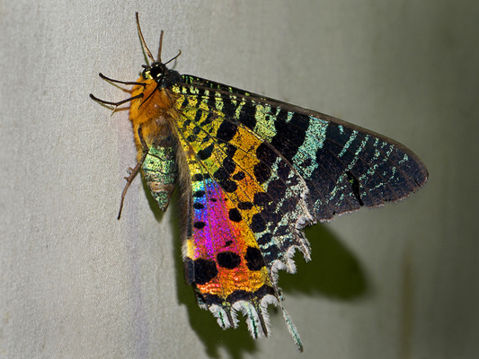
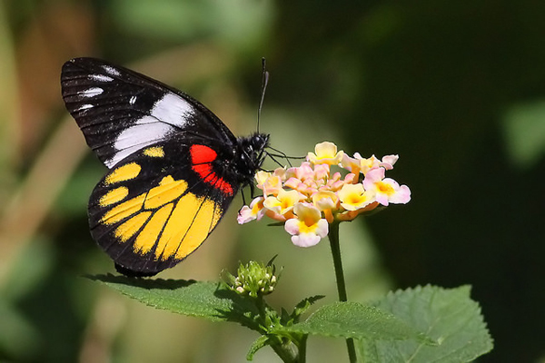
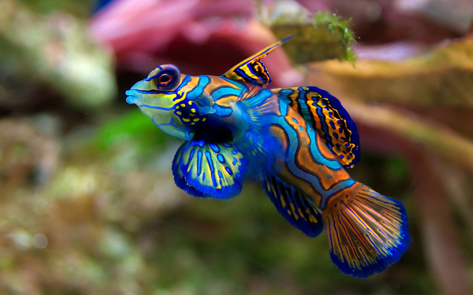
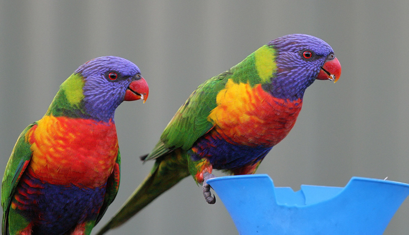

---
output:
  md_document:
    variant: markdown_github
---
```{r, echo = FALSE}
knitr::opts_chunk$set(
  collapse = TRUE,
  comment = "#>",
  fig.path = "figs/",
  fig.height = 1
)
```

## Nature's Palette

### 100% All-Natural Colour Palettes for R.

Nothing beats natural! A selection of (fairly impractical) palettes inspired by the world in colour. Feel free to send along a nice image of your favourite colourful organism---or suggest one, I'm out of ideas---and I'll weave it in.

### Install

Development version, via devtools: 
```R
devtools::install_github("thomased/natpalette")
```

### Usage

```{r, demo}
# Boot it up
library(natpalette)
```

----------

#### Maratus volans (peacock spider)


Photo: [Jurgen Otto](https://www.flickr.com/photos/59431731@N05/)

```{r, maratus}
nat_palette("Maratus")
```

----------

#### Acripeza reticulata (mountain katydid)


Photo: [Kate Umbers](http://www.kateumbers.com)

```{r, acripeza}
nat_palette("Acripeza")
```

----------

#### Aix galericulata (mandarin duck)


Photo: [Malcolm Carlaw](https://www.flickr.com/photos/lightsamples/)

```{r, aix}
nat_palette("Aix")
```

----------

#### Furcifer pardalis (panther chameleon)


Photo: [Christopher Evans](https://www.flickr.com/photos/chris_e/)

```{r, furcifur}
nat_palette("Furcifer")
```

----------

#### Chrysiridia rhipheus (Madagascan sunset moth)



Photo: [Frank Vassen](https://www.flickr.com/photos/42244964@N03/)

```{r, chrysiridia}
nat_palette("Chrysiridia")
```

----------

#### Coracias caudatus (lilac-breasted roller)


Photo: [Lip Kee](https://www.flickr.com/photos/lipkee/)

```{r, coracias}
nat_palette("Coracias")
```

----------

#### Delias henningia (Phillippine jezabel)



Photo: [Chris Chafer](https://www.flickr.com/photos/chris_chafer/)

```{r, delias}
nat_palette("Delias")
```

----------

#### Mandarinfish (Synchiropus splendidus)



Photo: [Jim Trodel](https://www.flickr.com/photos/trodel/)

```{r, synchiropus}
nat_palette("Synchiropus")
```

----------

#### Trichoglossus haematodus (rainbow lorikeet).



Photo: [Bill Collison](https://www.flickr.com/photos/billcollison/)

```{r, trichoglossus}
nat_palette("Trichoglossus")
```

----------

#### Tulipa gesneriana (Tulips)


Photo: [Matt Haughey](https://www.flickr.com/photos/mathowie/)

```{r, tulip}
nat_palette("Tulipa")
```

----------

### Acknowledgements
With thanks to [Karthik Ram](http://inundata.org) and the excellent [wesanderson](https://github.com/karthik/wesanderson) package, from which much of this is derived.
