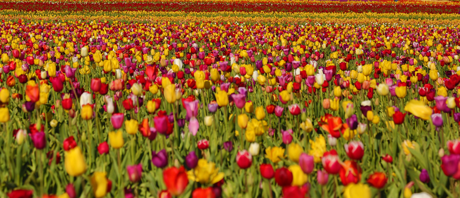

---
output:
  md_document:
    variant: markdown_github
---
```{r, echo = FALSE}
knitr::opts_chunk$set(
  collapse = TRUE,
  comment = "#>",
  fig.path = "figs/",
  fig.height = 1
)
```

## Nature's Palette

### 100% All-Natural Colour Palettes for R.

A selection of fairly impractical palettes inspired by the world in colour. Feel free to send along a clear image of your favourite (colourful) organism and I'll gladly include it.

### Install

Development version, via devtools: 
```R
devtools::install_github("thomased/natpalette")
```

### Usage

```{r, demo}
library(natpalette)
```

#### Maratus volans (peacock spider)

](./img/maratus.jpg)

```{r, maratus}
nat_palette("Maratus")
```

#### Acripeza reticulata (mountain katydid)

](./img/acripeza.jpg)

```{r, acripeza}
nat_palette("Acripeza")
```

#### Chrysiridia rhipheus (Madagascan sunset moth)

](./img/chrysiridia.jpg)

```{r, chrysiridia}
nat_palette("Chrysiridia")
```

#### Delias henningia (Phillippine jezabel)

](./img/delias.jpg)

```{r, delias}
nat_palette("Delias")
```

#### Trichoglossus haematodus (rainbow lorikeet).

](./img/trichoglossus.jpg)

```{r, trichoglossus}
nat_palette("Trichoglossus")
```

#### Tulipa gesneriana (Tulips)


Photo: [Matt Haughey](https://www.flickr.com/photos/mathowie/)

```{r, tulip}
nat_palette("Tulipa")
```

### Acknowledgements
With thanks to [Karthik Ram](http://inundata.org) and the excellent [wesanderson](https://github.com/karthik/wesanderson) package, from which elements of this package are derived.
