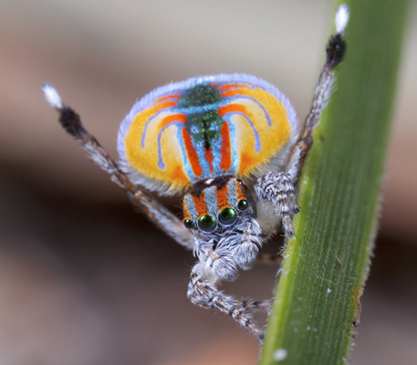
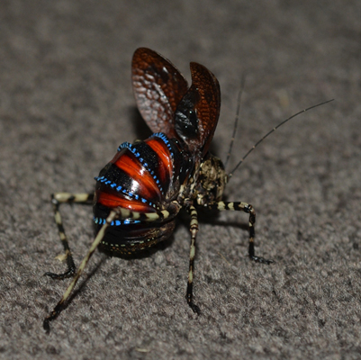
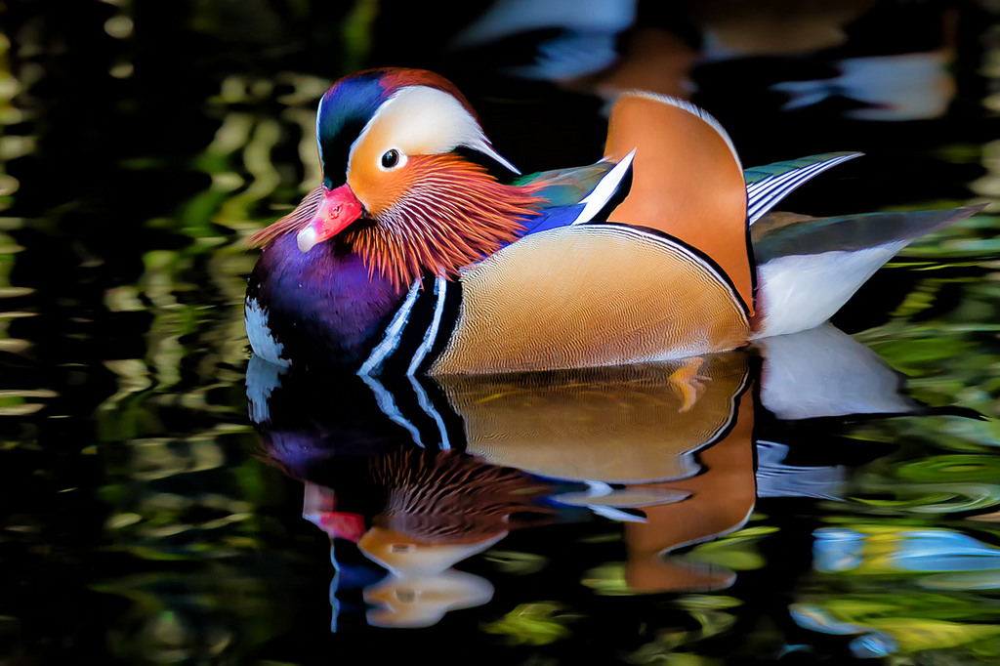
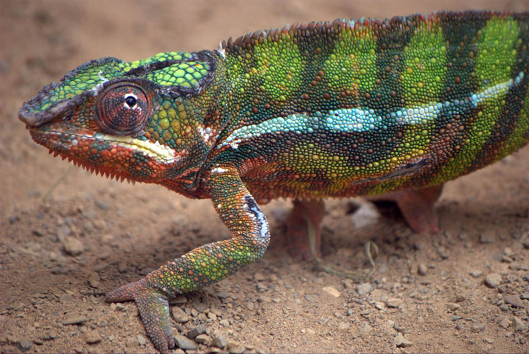
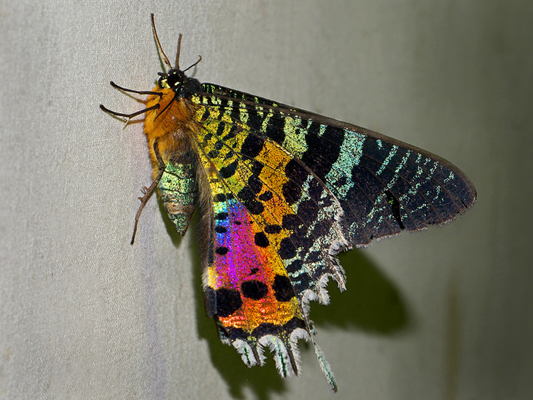
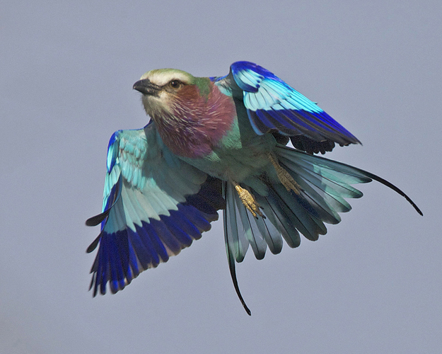
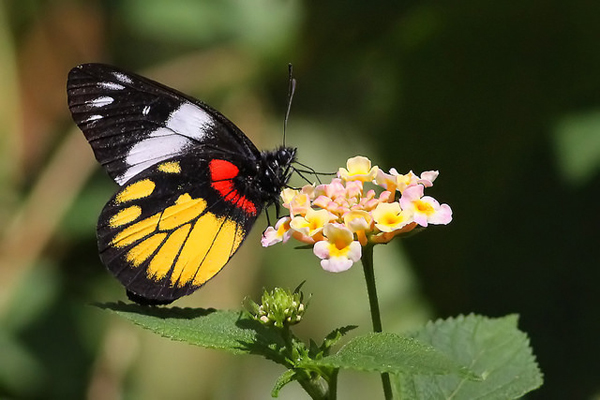
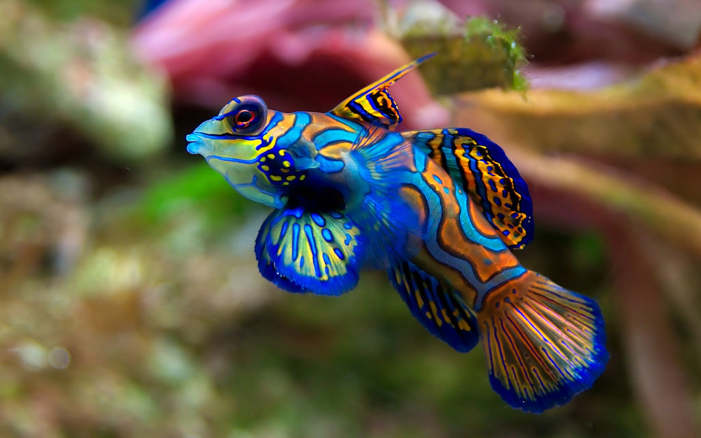
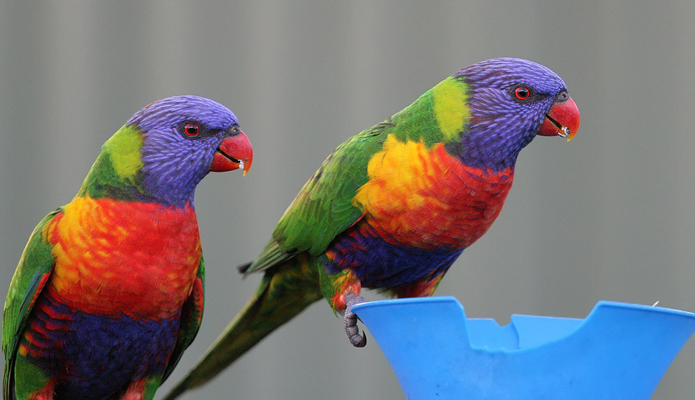
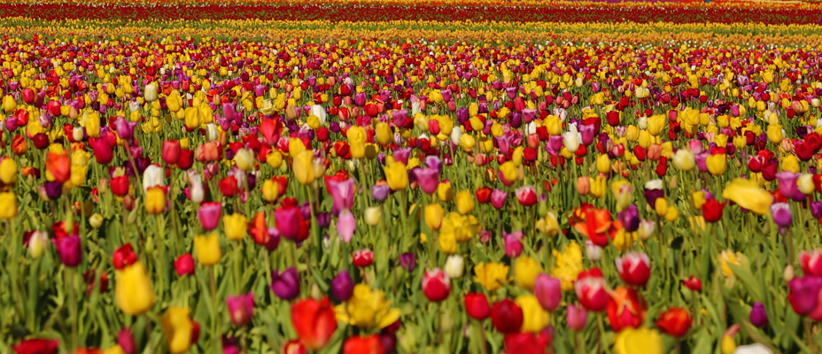

Nature's Palette
----------------

### 100% All-Natural Colour Palettes for R.

Nothing beats natural! A selection of (fairly impractical) palettes inspired by the world in colour. Feel free to send along a nice image of your favourite colourful organism---or suggest one, I'm out of ideas---and I'll weave it in.

### Install

Development version, via devtools:

``` r
devtools::install_github("thomased/natpalette")
```

### Usage

``` r
# Boot it up
library(natpalette)
```

------------------------------------------------------------------------

#### Maratus volans (peacock spider)



Photo: [Jurgen Otto](https://www.flickr.com/photos/59431731@N05/)

``` r
nat_palette("Maratus")
```


------------------------------------------------------------------------

#### Acripeza reticulata (mountain katydid)



Photo: [Kate Umbers](http://www.kateumbers.com)

``` r
nat_palette("Acripeza")
```


------------------------------------------------------------------------

#### Aix galericulata (mandarin duck)



Photo: [Malcolm Carlaw](https://www.flickr.com/photos/lightsamples/)

``` r
nat_palette("Aix")
```


------------------------------------------------------------------------

#### Furcifer pardalis (panther chameleon)



Photo: [Christopher Evans](https://www.flickr.com/photos/chris_e/)

``` r
nat_palette("Furcifer")
```


------------------------------------------------------------------------

#### Chrysiridia rhipheus (Madagascan sunset moth)



Photo: [Frank Vassen](https://www.flickr.com/photos/42244964@N03/)

``` r
nat_palette("Chrysiridia")
```


------------------------------------------------------------------------

#### Coracias caudatus (lilac-breasted roller)



Photo: [Lip Kee](https://www.flickr.com/photos/lipkee/)

``` r
nat_palette("Coracias")
```


------------------------------------------------------------------------

#### Delias henningia (Phillippine jezabel)



Photo: [Chris Chafer](https://www.flickr.com/photos/chris_chafer/)

``` r
nat_palette("Delias")
```


------------------------------------------------------------------------

#### Mandarinfish (Synchiropus splendidus)



Photo: [Jim Trodel](https://www.flickr.com/photos/trodel/)

``` r
nat_palette("Synchiropus")
```


------------------------------------------------------------------------

#### Trichoglossus haematodus (rainbow lorikeet).



Photo: [Bill Collison](https://www.flickr.com/photos/billcollison/)

``` r
nat_palette("Trichoglossus")
```


------------------------------------------------------------------------

#### Tulipa gesneriana (Tulips)



Photo: [Matt Haughey](https://www.flickr.com/photos/mathowie/)

``` r
nat_palette("Tulipa")
```


------------------------------------------------------------------------

### Acknowledgements

With thanks to [Karthik Ram](http://inundata.org) and the excellent [wesanderson](https://github.com/karthik/wesanderson) package, from which much of this is derived.
